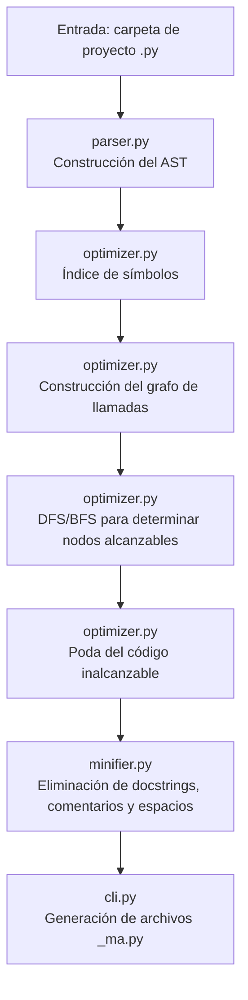

# Minimal App

En este proyecto implementamos un sistema capaz de analizar, optimizar y minificar programas escritos en Python. Nuestro objetivo es procesar un conjunto de módulos que forman una aplicación, identificar qué partes del código son realmente necesarias para ejecutar un entrypoint específico y generar una versión reducida del programa, eliminando elementos inalcanzables y detalles irrelevantes como comentarios y docstrings.

Todo el trabajo se organiza alrededor del Abstract Syntax Tree (AST), que construimos, analizamos y transformamos siguiendo la metodología típica de un curso de compiladores. Este proyecto permite comprender cómo se diseña un frontend de compilador simplificado, cómo se construye un grafo de alcance entre unidades de código y cómo se ejecuta un proceso de eliminación de código muerto.

---

## Estructura general del sistema

El proyecto está dividido en los siguientes módulos:

- `parser.py`  
- `optimizer.py`  
- `minifier.py`  
- `cli.py`

Cada módulo desempeña un rol específico dentro del pipeline de análisis y optimización.

---

## Construcción del AST

Construimos el AST en `parser.py`.

Utilizamos la librería estándar `ast` de Python para convertir el texto fuente en árboles sintácticos. Cada archivo `.py` corresponde a un `ast.Module`, que contiene nodos para funciones, clases, métodos y expresiones. En este punto únicamente parseamos el código y registramos la información básica de cada módulo.

Este paso corresponde a la fase de frontend del compilador: lectura del código fuente y conversión a una estructura sintáctica abstracta.

---

## Índice de símbolos y verificación de alcance

Una vez que tenemos el AST de cada archivo, construimos un índice global en `optimizer.py`.

En este índice almacenamos todas las funciones, clases y métodos definidos en los módulos analizados. Esto nos permite:

- Identificar todas las unidades definidas.  
- Localizar sus nodos AST.  
- Verificar cuáles símbolos existen y en qué módulo se encuentran.

Este índice actúa como una tabla de símbolos simplificada.

Posteriormente, recorremos cada función y método para identificar otras entidades a las que hacen referencia mediante llamadas o accesos. Esta verificación ocurre en `build_call_graph`, donde reconocemos qué funciones, clases o métodos dependen de otros.

---

## Construcción del grafo de llamadas

En `optimizer.py`, dentro de la función `build_call_graph`, recorremos los cuerpos de funciones y métodos y extraemos todas las referencias mediante un visitante del AST.

Cada referencia se modela como una arista dirigida en un grafo:

nodo_actual → nodo_referenciado

El grafo contiene:

- Nodos de tipo función  
- Nodos de tipo clase  
- Nodos de tipo método  

Este grafo permite realizar análisis de reachability para determinar qué partes del código son necesarias para ejecutar el entrypoint.

---

## Algoritmo BFS/DFS para determinar accesibilidad

En la función `dfs_reachable` de `optimizer.py`, aplicamos un recorrido DFS sobre el grafo de llamadas.

Partimos del nodo correspondiente al entrypoint, por ejemplo `("func", "app", "handler")`. A medida que avanzamos, identificamos los nodos que realmente pueden influir en la ejecución del programa.

Este análisis es equivalente a los recorridos sobre grafos usados en análisis de flujo de programas en cursos de compiladores.

---

## Poda del código inalcanzable

Una vez conocemos los nodos alcanzables, realizamos la poda en `prune_modules`, dentro de `optimizer.py`.

En esta etapa:

- Eliminamos funciones no alcanzables.  
- Eliminamos clases completas si ninguno de sus métodos es utilizado.  
- Eliminamos métodos no utilizados dentro de clases.  

Esto corresponde a un pase de eliminación de código muerto (*dead code elimination*).

---

## Eliminación de comentarios, docstrings y espacios innecesarios

La eliminación de elementos superficiales se implementa en `minifier.py`.

Aplicamos dos pasos:

1. Un visitante del AST (`DocstringRemover`) elimina los docstrings de módulos, clases y funciones.  
2. Convertimos nuevamente el AST a código con `ast.unparse`, lo que remueve comentarios y normaliza espacios.

El resultado es una versión del programa más compacta y libre de información no esencial.

---

## Ejecución mediante CLI

El módulo `cli.py` permite ejecutar todo el proceso desde la línea de comandos.

El sistema:

- Recolecta automáticamente todos los archivos `.py` de la carpeta del proyecto.  
- Construye los AST.  
- Ejecuta la optimización basada en accesibilidad.  
- Genera las versiones minimizadas con sufijo `_ma.py` en la carpeta de salida indicada.

El comando típico es:

python -m minimal_app.cli ruta/del/proyecto -o ruta_de_salida -e modulo:funcion

---

## Diagrama del flujo del sistema

